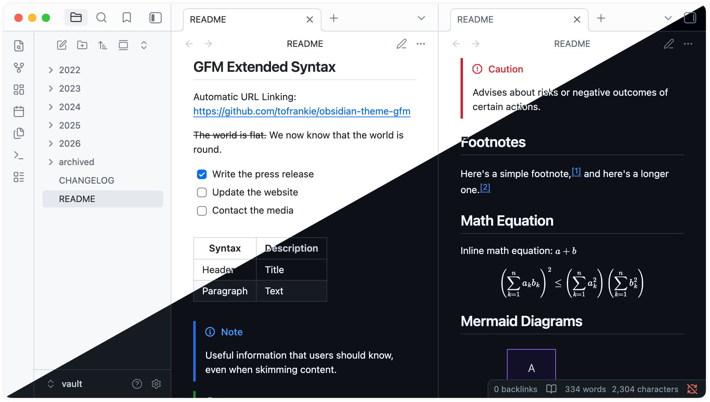

# Obsidian GitHub Flavored Markdown Theme

## Features

> Forked from [obsidian-theme-github](https://github.com/krios2146/obsidian-theme-github), with Kanban styling retained, some custom settings removed, and a closer GFM experience.

- Supports light and dark modes
- Provides a native GFM experience
- Supports GFM Alerts

## Preview

Screenshots

## Theme Settings

Theme settings can be found in the [Obsidian Style Settings](https://github.com/obsidian-community/obsidian-style-settings) plugin.

Current settings include:

- Kanban style toggle
- Color-blind-friendly color scheme variants

## How to Install

This theme is available on the Obsidian Theme [Store](https://community.obsidian.md/themes/github-flavored-markdown-theme).

Manually

1. Download the `theme.css` and `manifest.json` files from the latest [release](https://github.com/tofrankie/obsidian-gfm-theme/releases/)
2. Go to `/your_vault/.obsidian/themes/` and create a folder for the theme files
3. Paste the downloaded theme files into the created folder
4. In Obsidian, go to Settings -> Appearance -> Themes and select GitHub Flavored Markdown from the dropdown menu

## Contributing

See [CONTRIBUTING.md](./CONTRIBUTING.md) for details.

## Credits

Forked from [obsidian-theme-github](https://github.com/krios2146/obsidian-theme-github) by [krios2146](https://github.com/krios2146) ❤️

## License

MIT License © [Frankie](https://github.com/tofrankie)
