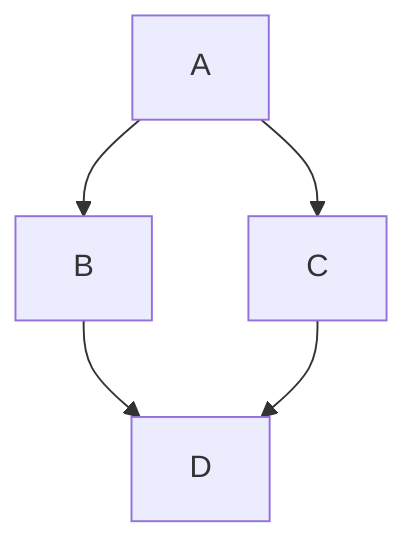

## GFM Extended Syntax

Automatic URL Linking: https://github.com/tofrankie/obsidian-gfm-theme

~~The world is flat.~~ We now know that the world is round.

- [x] Write the press release
- [ ] Update the website
- [ ] Contact the media

| Syntax    | Description |
| --------- | ----------- |
| Header    | Title       |
| Paragraph | Text        |

> [!NOTE]
> Useful information that users should know, even when skimming content.

> [!TIP]
> Helpful advice for doing things better or more easily.

> [!IMPORTANT]
> Key information users need to know to achieve their goal.

> [!WARNING]
> Urgent info that needs immediate user attention to avoid problems.

> [!CAUTION]
> Advises about risks or negative outcomes of certain actions.

## Markdown Basic Syntax

I just love **bold text**. Italicized text is the _cat's meow_. At the command prompt, type `nano`.

My favorite markdown editor is [ByteMD](https://github.com/pd4d10/bytemd).

1. First item
2. Second item

> Dorothy followed her through many of the beautiful rooms in her castle.

```js
function sayHello() {
  console.log('Hello World')
}
```

Save the document by pressing <kbd>Ctrl</kbd> + <kbd>S</kbd>

## Footnotes

Here's a simple footnote,[^1] and here's a longer one.[^bignote]

[^1]: This is the first footnote.

[^bignote]: Here's one with multiple paragraphs and code.

    Indent paragraphs to include them in the footnote.

    `{ my code }`

    Add as many paragraphs as you like.

## Math Equation

Inline math equation: $a+b$

$$
\displaystyle \left( \sum_{k=1}^n a_k b_k \right)^2 \leq \left( \sum_{k=1}^n a_k^2 \right) \left( \sum_{k=1}^n b_k^2 \right)
$$

## Mermaid Diagrams



A Mermaid diagram is a visual representation of structures or processes created using text and code rather than a traditional drag-and-drop editor.

## Gemoji

Thumbs up: :+1:, thumbs down: :-1:.

Families: :family_man_man_boy_boy:

Long flags: :wales:, :scotland:, :england:.

## Heading Level 2

subheading

### Heading Level 3

subheading

#### Heading Level 4

subheading

##### Heading Level 5

subheading

###### Heading Level 6

subheading
